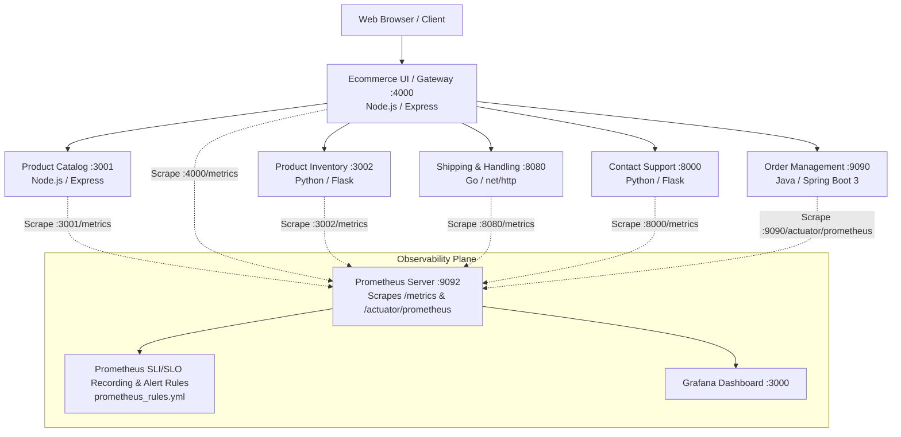

# Enterprise Observability & Site Reliability Engineering (SRE) Implementation Guide

## 1. Executive Summary & Core Objectives

### Primary Objective
The objective of this implementation is to establish a **production-grade, end-to-end Observability and SRE Framework** across all microservices in the distributed e-commerce architecture. 

By instrumenting every service with native Prometheus client libraries (`prom-client`, `prometheus-client`, `client_golang`, and `micrometer-registry-prometheus`), we provide continuous, real-time visibility into:
1. **Latency & Response Time**: Identifying internal processing bottlenecks and end-to-end network delays.
2. **Error Rate & Reliability**: Tracking client errors (4xx), server crashes (5xx), and application exceptions.
3. **Throughput & Request Volume**: Measuring traffic demand (Requests Per Second - RPS), volume trends, concurrent in-flight load, and network payload sizes.
4. **Resource Usage & Saturation**: Monitoring CPU usage, RAM/Heap consumption, disk capacity, and network bandwidth.
5. **Service Level Indicators (SLIs) & Service Level Objectives (SLOs)**: Quantifying user happiness, tracking error budgets, evaluating automated recording rules, and configuring multi-window burn rate alerts.

---

## 2. Architectural Overview



---

## 3. Pillar-by-Pillar Implementation Breakdown

### Pillar 1: Latency & Response Time Monitoring
- **Response Time**: Internal processing duration measured from request arrival to response completion.
- **Latency**: Round-trip time including gateway and network hops.
- **Histograms & Bucketing**:
  - `http_request_duration_seconds`: Standard buckets `[0.005, 0.01, 0.025, 0.05, 0.1, 0.25, 0.5, 1.0, 2.5, 5.0, 10.0]` seconds.
  - `http_response_time_milliseconds`: Direct millisecond buckets `[5, 10, 25, 50, 100, 250, 500, 1000, 2500, 5000, 10000]` ms.
  - Spring Boot SLA percentiles: configured for `5ms, 10ms, 25ms, 50ms, 100ms, 250ms, 500ms, 1s, 2s, 5s`.

### Pillar 2: Error Rate & Failure Metrics
- **`http_requests_total`**: Counter labeled by `method`, `route`/`endpoint`, and `status_code`.
- **`http_requests_errors_total`**: Counter capturing 4xx (client errors) and 5xx (server errors), labeled with `error_type` (`client_error` vs `server_error`).
- **`service_exceptions_total`**: Dedicated counter capturing unhandled code exceptions and database failure events labeled by `exception_type` and `operation`.
- **`downstream_service_errors_total`**: API Gateway metric tracking upstream failure propagation.

### Pillar 3: Throughput & Request Volume
- **Requests Per Second (RPS)**: Derived from continuous counter delta `rate(http_requests_total[1m])`.
- **`http_requests_in_flight` (Gauge)**: Tracks real-time active, simultaneous requests executing in memory. Incremented on request receipt, decremented on response termination.
- **`http_response_size_bytes` (Histogram)**: Tracks outgoing payload byte sizes for calculating network bandwidth consumption.

### Pillar 4: Resource Usage & Saturation
- **CPU Metrics**:
  - `process_cpu_seconds_total` (User & system CPU runtime).
  - `system_cpu_load_average_1m` (System 1-minute load average).
  - `process_cpu_usage` & `system_cpu_usage` (JVM CPU percentage).
- **Memory Metrics**:
  - `process_memory_rss_bytes` (Resident Set Size memory in RAM).
  - `process_heap_used_bytes` (Active heap usage).
  - `system_memory_free_bytes` & `system_memory_total_bytes` (Physical memory availability).
- **Storage Metrics**:
  - `system_disk_usage_bytes` (`type="total|used|free"` for root mount capacity).
  - `disk_free_bytes` / `disk_total_bytes` (Spring Boot disk status).

### Pillar 5: Service Level Indicators (SLIs) & Service Level Objectives (SLOs)
Configured Prometheus recording rules and alert definitions in `prometheus_rules.yml`:

| SLI Name | Formula | SLO Target | Error Budget | Alert Rule |
|---|---|---|---|---|
| **Availability** | $\frac{\text{Successful Requests (Non-5xx)}}{\text{Total Requests}}$ | **$\ge 99.5\%$** over 30d | $0.5\%$ error rate | `SLOAvailabilityBreachCritical` |
| **Fast Latency** | $\frac{\text{Requests} \le 250\text{ms}}{\text{Total Requests}}$ | **$\ge 95.0\%$** of requests $\le 250\text{ms}$ | $5.0\%$ slow rate | `SLOLatencyBreachWarning` |
| **Tail Latency** | $\frac{\text{Requests} \le 500\text{ms}}{\text{Total Requests}}$ | **$\ge 98.0\%$** of requests $\le 500\text{ms}$ | $2.0\%$ slow rate | `SLOLatencyBreachCritical` |
| **Error Rate** | $\frac{5\text{xx Server Errors}}{\text{Total Requests}}$ | **$\le 0.5\%$** error rate | $0.5\%$ | `SLOErrorRateHigh` |
| **Burn Rate** | Multi-window error consumption | **$1\times$** baseline burn | $100\%$ | `SLOErrorBudgetFastBurn` ($14.4\times$ burn) |
| **Instance Health** | `up == 1` | **$100\%$** availability | 0 outages | `MicroserviceDown` |

---

## 4. Microservice Implementation Matrix

### 1. Product Catalog Service (`product-catalog-code` & `product-catalog-src`)
- **Technology**: Node.js / Express / MongoDB / Redis
- **Library**: `prom-client`
- **Exposed Endpoint**: `GET http://<host>:3001/metrics`
- **Key Features**:
  - High-resolution timing (`process.hrtime.bigint()`) on incoming Express requests.
  - Automatic `prom-client.collectDefaultMetrics` with process & runtime metrics.
  - Real-time in-flight gauge tracking active concurrent requests.
  - Dynamic memory (RSS & Heap), system free memory, and 1-minute load average computation on `/metrics`.

### 2. Ecommerce UI Gateway (`ecommerce-ui-code/server`)
- **Technology**: Node.js / Express (ES Modules)
- **Library**: `prom-client`
- **Exposed Endpoint**: `GET http://<host>:4000/metrics`
- **Key Features**:
  - Gateway-level request duration and response time histograms.
  - Downstream service failure counter (`downstream_service_errors_total`).
  - Active in-flight requests gauge (`http_requests_in_flight`).
  - Egress payload size tracking (`http_response_size_bytes`).

### 3. Product Inventory Service (`product-inventory-src`)
- **Technology**: Python 3.11 / Flask / PostgreSQL
- **Library**: `prometheus-client`
- **Exposed Endpoint**: `GET http://<host>:3002/metrics`
- **Key Features**:
  - `@app.before_request` and `@app.after_request` middleware hooks measuring execution duration.
  - `HTTP_REQUESTS_IN_FLIGHT` concurrency tracking.
  - Disk capacity inspection via `shutil.disk_usage('/')` exposing `system_disk_usage_bytes`.
  - CPU load average inspection via `os.getloadavg()` exposing `system_cpu_load_average_1m`.

### 4. Contact Support Service (`contact-support-team-src`)
- **Technology**: Python 3.11 / Flask / PostgreSQL
- **Library**: `prometheus-client`
- **Exposed Endpoint**: `GET http://<host>:8000/metrics`
- **Key Features**:
  - Request duration & response time histograms in seconds and milliseconds.
  - Error rate tracking categorizing 4xx client errors and 5xx server errors.
  - Dynamic disk space and CPU load metrics generation on `/metrics`.

### 5. Shipping & Handling Service (`shipping-and-handling-src`)
- **Technology**: Go 1.25 / `net/http` / PostgreSQL
- **Library**: `github.com/prometheus/client_golang`
- **Exposed Endpoint**: `GET http://<host>:8080/metrics`
- **Key Features**:
  - Custom `responseWriterWithStatus` wrapper capturing HTTP status code and written byte count.
  - `prometheusMiddleware` tracking latency, response time, request counters, error rates, and payload sizes.
  - Native Go runtime metrics (`go_goroutines`, `go_memstats_*`, `process_cpu_seconds_total`).

### 6. Order Management Service (`order-management-code`)
- **Technology**: Java 17 / Spring Boot 3.2.3 / PostgreSQL
- **Library**: `spring-boot-starter-actuator` + `micrometer-registry-prometheus`
- **Exposed Endpoint**: `GET http://<host>:9090/actuator/prometheus`
- **Key Features**:
  - Automatic `http.server.requests` percentile histograms (p50, p90, p95, p99) and SLA buckets (5ms to 5s).
  - JVM Memory (heap/non-heap), Garbage Collection pauses, and thread pool monitoring.
  - Process and system CPU usage percentages.

---

## 5. Prometheus Scrape & Alert Configuration

### Scrape Configuration ([docker-compose/prometheus.yml](file:///r:/Devops%20territory/ecom/docker-compose/prometheus.yml))
```yaml
global:
  scrape_interval: 10s
  evaluation_interval: 10s

rule_files:
  - 'prometheus_rules.yml'

scrape_configs:
  - job_name: 'product-catalog'
    metrics_path: '/metrics'
    static_configs:
      - targets: ['product-catalog:3001']

  - job_name: 'product-inventory'
    metrics_path: '/metrics'
    static_configs:
      - targets: ['product-inventory:3002']

  - job_name: 'shipping-handling'
    metrics_path: '/metrics'
    static_configs:
      - targets: ['shipping-handling:8080']

  - job_name: 'contact-support'
    metrics_path: '/metrics'
    static_configs:
      - targets: ['contact-support:8000']

  - job_name: 'order-management'
    metrics_path: '/actuator/prometheus'
    static_configs:
      - targets: ['order-management:9090']

  - job_name: 'ecommerce-ui'
    metrics_path: '/metrics'
    static_configs:
      - targets: ['ecommerce-ui:4000']
```

---

## 6. Comprehensive PromQL Query Reference

### Latency & Response Time
```promql
# 95th Percentile Response Time across microservices (in ms)
histogram_quantile(0.95, sum(rate(http_request_duration_seconds_bucket[5m])) by (le, job)) * 1000

# 99th Percentile Response Time per Route
histogram_quantile(0.99, sum(rate(http_request_duration_seconds_bucket[5m])) by (le, route, job))

# Average Response Time (in seconds)
sum(rate(http_request_duration_seconds_sum[5m])) / sum(rate(http_request_duration_seconds_count[5m]))
```

### Throughput & Volume
```promql
# Total Throughput (Requests Per Second - RPS)
sum(rate(http_requests_total[1m]))

# Throughput per Service
sum(rate(http_requests_total[1m])) by (job)

# Total Request Volume in last 1 hour
sum(increase(http_requests_total[1h])) by (job)

# Current Concurrent In-Flight Load
sum(http_requests_in_flight) by (job)
```

### Error Rate & Reliability
```promql
# 5xx Server Error Rate (%)
(sum(rate(http_requests_total{status_code=~"5.."}[5m])) / sum(rate(http_requests_total[5m]))) * 100

# Total Error Rate (4xx + 5xx) (%)
(sum(rate(http_requests_errors_total[5m])) / sum(rate(http_requests_total[5m]))) * 100

# Service Exceptions per second
sum(rate(service_exceptions_total[5m])) by (exception_type, job)
```

### Resource Usage & Capacity
```promql
# CPU Utilization (% of Core)
sum(rate(process_cpu_seconds_total[1m])) by (job) * 100

# Memory Consumption (RAM RSS in MB)
sum(process_memory_rss_bytes or process_resident_memory_bytes or jvm_memory_used_bytes{area="heap"}) by (job) / (1024 * 1024)

# Free Disk Space (GB)
system_disk_usage_bytes{type="free"} / (1024 * 1024 * 1024)

# Network Egress Bandwidth (MB/s)
sum(rate(http_response_size_bytes_sum[1m])) by (job) / (1024 * 1024)
```

### SLI / SLO Compliance
```promql
# 5-minute Availability SLI Ratio (SLO >= 0.995)
job:sli_availability:ratio_5m

# Fast Latency Compliance Ratio (SLO >= 0.95 for <= 250ms)
job:sli_latency_le_250ms:ratio_5m

# 30-Day Error Budget Remaining (%)
(1 - (sum(increase(http_requests_total{status_code=~"5.."}[30d])) / (0.005 * sum(increase(http_requests_total[30d]))))) * 100
```

---

## 7. Grafana Dashboard Assets

The production Grafana Dashboard JSON has been created in:
- `R:\Devops territory\monitoring-ops-stack\grafana-dashboards\ecom-microservices-observability.json`
- `R:\Devops territory\ecom\grafana-dashboards\ecom-microservices-observability.json`
- `R:\Devops territory\ecom\docker-compose\grafana\provisioning\dashboards\ecom-microservices-observability.json`

