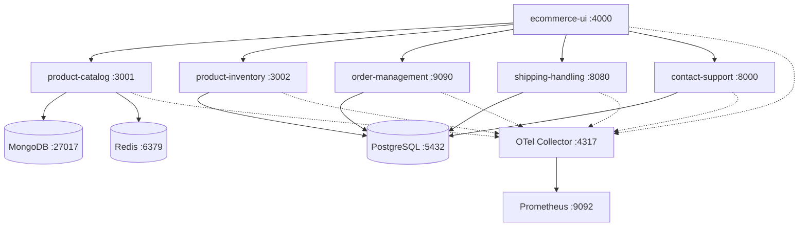

# 🛒 End-to-End E-Commerce Microservices Stack

This repository hosts a multi-service, polyglot E-Commerce application integrated with a comprehensive DevOps, automation, and observability pipeline.

---

## 🏗️ Architecture & Component Overview

The platform is designed around **six microservices** and **three databases**, fully instrumented with **OpenTelemetry (OTel)** tracing and metrics:



### Technical Stack
* **`ecommerce-ui` (Node.js/React)**: Serves static assets and acts as the entry API Gateway.
* **`product-catalog` (Node.js/Express)**: Manages catalog lookups using MongoDB and Redis cache.
* **`product-inventory` (Python/Flask)**: Handles product stock availability stored in PostgreSQL.
* **`order-management` (Java/Spring Boot)**: Places and manages client purchase histories in PostgreSQL.
* **`shipping-handling` (Go)**: Calculates shipping fee rates based on product weight/category.
* **`contact-support` (Python/Flask)**: Receives user queries and logs them to PostgreSQL.

---

## 🚀 Deployment Options

This repository supports three deployment configurations:

### Option 1: Docker Compose (Local Dev)
The easiest way to run the entire system locally:
```bash
cd docker-compose
docker-compose up -d --build
```
Access points:
* **UI Gateway**: `http://localhost:4000`
* **Prometheus**: `http://localhost:9092`

---

### Option 2: SaltStack Provisioning (Configuration Management)
SaltStack automation installs Docker, templates environments, links source directories, and configures the microservices automatically. 

Execute locally in masterless mode from the repository root:
```bash
sudo salt-call --local \
  --file-root=$(pwd)/salt-stack/salt \
  --pillar-root=$(pwd)/salt-stack/pillar \
  state.apply
```

---

### Option 3: Terraform Infrastructure Deployment (GCP Cloud)
Provisions a dedicated GCP Compute Engine instance (`e2-medium`) inside your default VPC and automatically bootstraps the SaltStack provisioning script above.

```bash
cd terraform
terraform init
terraform apply -var="project_id=YOUR_GCP_PROJECT_ID"
```
Refer to the [Terraform README](file:///r:/Devops%20territory/ecom/terraform/README.md) for full parameters.

---

## 📊 Observability & Metrics

Metrics are gathered by OpenTelemetry SDKs, sent to the OTel Collector, and scraped by Prometheus. 

### Key Metrics to Monitor
* **`ecom_http_server_active_requests`**: Count of concurrent requests per microservice.
* **`ecom_http_server_request_duration_seconds_bucket`**: Request latency histograms.
* **`ecom_process_cpu_utilization`**: CPU usage by service container.
* **`ecom_jvm_memory_used_bytes`**: Memory footprint of the Java `order-management` service.
